# Legal Document Processing System

An AI-powered solution for automating legal docketing and deadline extraction from legal documents, addressing critical pain points in law firm operations where missing court-mandated deadlines can result in malpractice claims, client losses, and severe financial penalties.

## Overview

This system uses state-of-the-art AI models including DOTS.OCR for document processing and Claude 4 Sonnet for intelligent extraction to automate the processing of legal documents, extract critical deadlines, and route them appropriately for review.

## Key Features

- **Automated Document Processing**: Handles PDFs, images, Word documents with varying quality
- **PII Protection**: Masks sensitive information before AI processing
- **Intelligent Classification**: Uses Claude 4 Sonnet to classify documents and extract entities
- **Deadline Calculation**: Jurisdiction-specific deadline calculations with holiday handling
- **Confidence Scoring**: Multi-factor scoring to determine routing (auto-process, paralegal review, attorney review)
- **RAG Enhancement**: Optional pattern matching using AWS OpenSearch for improved accuracy

## Architecture

```mermaid
---
config:
  theme: base
  themeVariables:
    primaryColor: '#fff'
    primaryTextColor: '#000'
    primaryBorderColor: '#000'
    lineColor: '#000'
    secondaryColor: '#f3f3f3'
    tertiaryColor: '#fff'
  flowchart:
    htmlLabels: false
    curve: basis
    useMaxWidth: true
    rankdir: LR
---
flowchart LR
    
    %% Node color definitions - all nodes in same subgraph have same color
    classDef blueNode fill:#bbdefb,stroke:#1565c0,stroke-width:3px,color:#0d47a1,stroke-dasharray: 5 5
    classDef orangeNode fill:#ffe0b2,stroke:#ef6c00,stroke-width:3px,color:#e65100,stroke-dasharray: 5 5
    classDef purpleNode fill:#e1bee7,stroke:#6a1b9a,stroke-width:3px,color:#4a148c,stroke-dasharray: 5 5
    classDef greenNode fill:#c8e6c9,stroke:#388e3c,stroke-width:3px,color:#1b5e20,stroke-dasharray: 5 5
    classDef pinkNode fill:#f8bbd0,stroke:#c2185b,stroke-width:3px,color:#880e4f,stroke-dasharray: 5 5
    classDef grayNode fill:#e0e0e0,stroke:#616161,stroke-width:3px,color:#212121,stroke-dasharray: 5 5

    %% Document Ingestion Layer [BLUE]
    subgraph ING["`**DOCUMENT INGESTION**`"]
        style ING fill:#e3f2fd,stroke:#0d47a1,stroke-width:4px,stroke-dasharray: 10 5
        A("`Multi-Channel
        Input`")
        B("`S3 Landing
        Zone`")
        C("`Lambda
        Preprocessor`")
        A --> B
        B --> C
    end
    
    %% AI Processing Pipeline [PURPLE]
    subgraph AI["`**AI PROCESSING PIPELINE**`"]
        style AI fill:#f3e5f5,stroke:#4a148c,stroke-width:4px,stroke-dasharray: 10 5
        
        G("`Layout & Text
        Extraction
        *[DOTS.OCR]*`")
        
        %% Security & Compliance nested within AI Processing
        subgraph SEC["`**SECURITY & COMPLIANCE**`"]
            style SEC fill:#fff3e0,stroke:#e65100,stroke-width:3px,stroke-dasharray: 5 3
            D("`PII Detection
            & Masking
            *[Regex + NER]*`")
            H("`Data
            Sanitization
            *[Tokenization]*`")
            E("`Encryption
            & Audit
            *[AES-256]*`")
            D --> H
            H --> E
        end
        
        DC("`Document
        Classification
        *[LLM]*`")
        
        NER("`Named Entity
        Recognition
        *[LLM]*`")
        
        J("`Deadline
        Extraction
        *[LLM]*`")
        
        %% Internal AI Pipeline connections
        G --> D
        E --> DC
        DC --> NER
        NER --> J
    end
    
    %% Validation & Calculation Layer [GREEN]
    subgraph VAL["`**RAG (VALIDATION & CALCULATION)**`"]
        style VAL fill:#e8f5e9,stroke:#1b5e20,stroke-width:4px,stroke-dasharray: 10 5
        K("`Deadline
        Validation
        *[Rule Matching]*`")
        L("`Jurisdiction
        Rules DB
        *[OpenSearch]*`")
        M("`Date
        Calculation
        *[Calendar Logic]*`")
        P("`Confidence
        Scoring
        *[Historical Accuracy]*`")
        
        K --> L
        L --> M
        M --> P
    end
    
    %% Output & Integration Layer [PINK]
    subgraph OUT["`**OUTPUT & INTEGRATION**`"]
        style OUT fill:#fce4ec,stroke:#880e4f,stroke-width:4px,stroke-dasharray: 10 5
        Q("`Structured
        JSON`")
        R("`API
        Gateway`")
        S("`Practice Mgmt
        Systems`")
        T("`Human Review
        Queue`")
        W("`Calendar
        Systems`")
        X("`Mobile
        Apps`")
        
        Q --> R
        R --> S
        R --> T
        R --> W
        R --> X
    end
    
    %% Monitoring & Feedback [GRAY]
    subgraph MON["`**MONITORING & FEEDBACK**`"]
        style MON fill:#f5f5f5,stroke:#212121,stroke-width:4px,stroke-dasharray: 10 5
        U("`Feedback
        Loop`")
        V("`CloudWatch
        Monitoring`")
    end
    
    %% Main flow connections
    C --> G
    J --> K
    P --> Q
    
    %% Feedback connections
    T --> U
    U --> M
    Q --> V
    
    %% Apply node styles - all nodes in same subgraph get same color
    class A,B,C blueNode
    class G,DC,NER,J purpleNode
    class D,H,E orangeNode
    class K,L,M,P greenNode
    class Q,R,S,T,W,X pinkNode
    class U,V grayNode
```



## Installation

### Setup

```bash
# Clone repository
git clone https://github.com/yike5460/legal-document-processing.git
cd legal-document-processing

# Create virtual environment
python -m venv venv
source venv/bin/activate  # On macOS/Linux

# Install dependencies
pip install -r requirements.txt
pip install -e ".[dev]"

# Create .env.local file with AWS credentials (optional for full functionality)
cat > .env.local << EOF
AWS_REGION=us-east-1
AWS_ACCESS_KEY_ID=your_actual_key
AWS_SECRET_ACCESS_KEY=your_actual_secret
OPENSEARCH_DOMAIN=your_domain  # optional
EOF
```

## Demo Guide

### Quick Start

The demo implementation provides a comprehensive testing environment for the legal document processing system. Located in `demo/`, it includes interactive tutorials and automated tests.

**Setup Requirements**:
```bash
# Install dependencies
cd demo/
pip install -r requirements.txt
pip install -e ".[dev]"

# Configure AWS credentials (optional for full functionality)
cp .env.local.example .env.local
# Edit .env.local with your AWS credentials
```

### Interactive Tutorial System

The main tutorial (`demo/tutorial.py`) provides 6 interactive demos showcasing each component:

```bash
# Run the interactive tutorial
python demo/tutorial.py
```

### Process Sample Documents

```python
from src.pipeline.main_pipeline import LegalDocumentPipeline, PipelineConfig
import asyncio

# Configure pipeline
config = PipelineConfig(
    enable_pii_masking=True,
    enable_rag=False,  # Set True if OpenSearch configured
    confidence_threshold_auto=0.95
)

# Process document
async def process():
    pipeline = LegalDocumentPipeline(config)
    result = await pipeline.process_document("samples/court_order_sample.pdf")
    print(f"Deadlines found: {len(result.deadlines)}")
    for deadline in result.deadlines:
        print(f"  - {deadline['action']}: {deadline['calculated_date']}")

asyncio.run(process())
```

## Project Structure

```
legal-document-processing/
├── src/
│   ├── core/              # Core processing modules
│   │   ├── ai_extractor.py
│   │   ├── confidence_scorer.py
│   │   ├── deadline_calculator.py
│   │   ├── document_classifier.py
│   │   └── ocr_processor.py
│   ├── pipeline/          # Main pipeline orchestration
│   │   └── main_pipeline.py
│   └── utils/            # Utility modules
│       ├── pii_masker.py
│       ├── data_validator.py
│       └── logger.py
├── demo/                 # Demo and test files
│   ├── tutorial.py       # Interactive demos
│   └── test_system.py    # Automated tests
├── samples/              # Sample legal documents
├── api/                  # API integration
└── requirements.txt
```

## AWS Services Required

- **AWS Bedrock**: Claude 4 Sonnet model access (required for full AI capabilities)
- **AWS OpenSearch**: Vector storage for RAG (optional, enhances accuracy)
- **AWS S3**: Document storage (optional)

## Configuration

The system can be configured via `PipelineConfig`:

```python
from src.pipeline.main_pipeline import PipelineConfig

config = PipelineConfig(
    dots_ocr_model="rednote-hilab/dots.ocr",
    claude_model="anthropic.claude-4-sonnet-20241022-v1:0",
    confidence_threshold_auto=0.95,
    enable_pii_masking=True,
    enable_rag=False  # Set True if OpenSearch available
)
```

## Performance

- Average processing time: 8 seconds per document
- Supports batch processing with configurable concurrency
- OpenSearch caching reduces repeated pattern lookups
- PII masking adds ~0.5 seconds overhead

## Contributing

Please read the development guidelines in the proposal document for detailed information about the architecture and implementation.

## License

This project is licensed under the Apache License 2.0 - see the LICENSE file for details.

## Documentation

For detailed technical documentation, see [legal-document-processing-proposal.md](legal-document-processing-proposal.md)
