# Automated Document Processing System for Legal Operations

## 1. Executive Summary

This proposal presents an AI-powered solution for automating legal docketing and deadline extraction from legal documents, addressing a critical pain point in law firm operations where missing court-mandated deadlines can result in malpractice claims, client losses, and severe financial penalties.

## 2. Domain Understanding

### 2.1 Legal Docketing (Legal Calendaring)

The systematic process of tracking court dates, filing deadlines, and procedural time limits governed by statutes, court rules, and case-specific orders. Every court case generates multiple time-sensitive events: motion filing deadlines, hearing dates, response windows etc.dictated by a complex interplay of Federal/State procedural rules, local court requirements, judge-specific standing orders or case-specific modifications. Thu law firms employ specialized docket clerks or rely on paralegals/attorneys to maintain these systems, processing hundreds of documents daily to extract and monitor critical dates.

### 2.2 Challenging in Autonomous Pipeline

| Challenge | Technical Complexity |
|-----------|---------------------|
| **Document Variability** | PDFs, scanned images, faxes, Word files arrive with varying quality. Low-resolution scans and handwritten annotations make OCR unreliable |
| **Multiple Rule Systems** | Federal Rules of Civil Procedure interact with local rules and judge-specific modifications, creating a dynamic, evolving ruleset |
| **Ambiguity & Exceptions** | Instead of "Deadline: August 20, 2025", orders state "Plaintiff shall file opposition within 14 days of this order," requiring semantic understanding and date calculation; Phrases like "unless otherwise ordered" introduce conditionals; Holiday/weekend calculations vary by jurisdiction and rule type |
| **Context Dependency** | Deadlines like "10 days after service of motion" require tracking procedural triggers and understanding when prior events occurred |
| **Zero-Error Tolerance** | Unlike other AI applications where 90%+ accuracy is acceptable, legal docketing demands near-perfect precision due to irreversible consequences, e.g. case dismissal, malpractice liability, ethics violation etc. |

## 3. Technical Architecture

### 3.1 System Design

```mermaid
---
config:
  theme: base
  themeVariables:
    primaryColor: '#fff'
    primaryTextColor: '#000'
    primaryBorderColor: '#000'
    lineColor: '#000'
    secondaryColor: '#f3f3f3'
    tertiaryColor: '#fff'
  flowchart:
    htmlLabels: false
    curve: basis
    useMaxWidth: true
    rankdir: LR
---
flowchart LR
    
    %% Node color definitions - all nodes in same subgraph have same color
    classDef blueNode fill:#bbdefb,stroke:#1565c0,stroke-width:3px,color:#0d47a1,stroke-dasharray: 5 5
    classDef orangeNode fill:#ffe0b2,stroke:#ef6c00,stroke-width:3px,color:#e65100,stroke-dasharray: 5 5
    classDef purpleNode fill:#e1bee7,stroke:#6a1b9a,stroke-width:3px,color:#4a148c,stroke-dasharray: 5 5
    classDef greenNode fill:#c8e6c9,stroke:#388e3c,stroke-width:3px,color:#1b5e20,stroke-dasharray: 5 5
    classDef pinkNode fill:#f8bbd0,stroke:#c2185b,stroke-width:3px,color:#880e4f,stroke-dasharray: 5 5
    classDef grayNode fill:#e0e0e0,stroke:#616161,stroke-width:3px,color:#212121,stroke-dasharray: 5 5

    %% Document Ingestion Layer [BLUE]
    subgraph ING["`**DOCUMENT INGESTION**`"]
        style ING fill:#e3f2fd,stroke:#0d47a1,stroke-width:4px,stroke-dasharray: 10 5
        A("`Multi-Channel
        Input`")
        B("`S3 Landing
        Zone`")
        C("`Lambda
        Preprocessor`")
        A --> B
        B --> C
    end
    
    %% AI Processing Pipeline [PURPLE]
    subgraph AI["`**AI PROCESSING PIPELINE**`"]
        style AI fill:#f3e5f5,stroke:#4a148c,stroke-width:4px,stroke-dasharray: 10 5
        
        G("`Layout & Text
        Extraction
        *[DOTS.OCR]*`")
        
        %% Security & Compliance nested within AI Processing
        subgraph SEC["`**SECURITY & COMPLIANCE**`"]
            style SEC fill:#fff3e0,stroke:#e65100,stroke-width:3px,stroke-dasharray: 5 3
            D("`PII Detection
            & Masking
            *[Regex + NER]*`")
            H("`Data
            Sanitization
            *[Tokenization]*`")
            E("`Encryption
            & Audit
            *[AES-256]*`")
            D --> H
            H --> E
        end
        
        DC("`Document
        Classification
        *[LLM]*`")
        
        NER("`Named Entity
        Recognition
        *[LLM]*`")
        
        J("`Deadline
        Extraction
        *[LLM]*`")
        
        %% Internal AI Pipeline connections
        G --> D
        E --> DC
        DC --> NER
        NER --> J
    end
    
    %% Validation & Calculation Layer [GREEN]
    subgraph VAL["`**RAG (VALIDATION & CALCULATION)**`"]
        style VAL fill:#e8f5e9,stroke:#1b5e20,stroke-width:4px,stroke-dasharray: 10 5
        K("`Deadline
        Validation
        *[Rule Matching]*`")
        L("`Jurisdiction
        Rules DB
        *[OpenSearch]*`")
        M("`Date
        Calculation
        *[Calendar Logic]*`")
        P("`Confidence
        Scoring
        *[Historical Accuracy]*`")
        
        K --> L
        L --> M
        M --> P
    end
    
    %% Output & Integration Layer [PINK]
    subgraph OUT["`**OUTPUT & INTEGRATION**`"]
        style OUT fill:#fce4ec,stroke:#880e4f,stroke-width:4px,stroke-dasharray: 10 5
        Q("`Structured
        JSON`")
        R("`API
        Gateway`")
        S("`Practice Mgmt
        Systems`")
        T("`Human Review
        Queue`")
        W("`Calendar
        Systems`")
        X("`Mobile
        Apps`")
        
        Q --> R
        R --> S
        R --> T
        R --> W
        R --> X
    end
    
    %% Monitoring & Feedback [GRAY]
    subgraph MON["`**MONITORING & FEEDBACK**`"]
        style MON fill:#f5f5f5,stroke:#212121,stroke-width:4px,stroke-dasharray: 10 5
        U("`Feedback
        Loop`")
        V("`CloudWatch
        Monitoring`")
    end
    
    %% Main flow connections
    C --> G
    J --> K
    P --> Q
    
    %% Feedback connections
    T --> U
    U --> M
    Q --> V
    
    %% Apply node styles - all nodes in same subgraph get same color
    class A,B,C blueNode
    class G,DC,NER,J purpleNode
    class D,H,E orangeNode
    class K,L,M,P greenNode
    class Q,R,S,T,W,X pinkNode
    class U,V grayNode
```



**Document Processing Pipeline**

| Step | Process | Technology | Purpose | Output |
|------|---------|------------|---------|--------|
| **1** | **Document Ingestion** | Lambda + S3 | Validate, normalize, queue documents | Clean PDF ready for processing |
| **2** | **Layout & Text Extraction** | DOTS.OCR (1.7B) | Extract text and layout from raw documents | Structured text in JSON format |
| **3** | **Security & Compliance** | Regex + Mapping Table | Avoid sensitive data exposed | Compliant JSON |
| **4** | **Document Classification** | LLM | Identify document type using masked text | Type + extraction hints |
| **5** | **NER & Deadline Extraction** | LLM | Extract entity, deadline phrases from masked text | "within 14 days", "by January 31" |
| **6** | **Validation** | Rule Matching | Verify extracted deadlines are legally valid | Valid/Invalid + applicable rule |
| **7** | **Calculation** | Jurisdiction Rules | Convert "14 days" to actual date using rules | "January 28, 2025" |
| **8** | **Routing** | Business Rules | Assign to human review or auto-processing based on doc type & confidence | Attorney/Paralegal/Auto queue |
| **9** | **Integration** | API Gateway | Deliver to calendars, practice systems and Human In the Loop | REST API responses |

**Human In the Loop Logic Explained**:

The routing step determines whether deadlines go to human review or auto-processing:

| Document Type | Confidence Level | Routing Decision | Rationale |
|---------------|------------------|------------------|-----------|
| **Court Order** | Any confidence | **Attorney Review** | Court orders are legally binding with severe consequences for errors |
| **Motion** | ≥95% confidence | **Auto-Process** | High confidence + lower risk = safe to automate |
| **Motion** | 85-94% confidence | **Paralegal Review** | Good confidence but needs human verification |
| **Motion** | <85% confidence | **Attorney Review** | Low confidence requires legal expertise |
| **Notice** | ≥90% confidence | **Auto-Process** | Informational documents with lower risk |
| **Complaint/Answer** | ≥92% confidence | **Auto-Process** | Initial filings with clear deadlines |
| **Any Type** | <85% confidence | **Attorney Review** | Always escalate low confidence to attorneys |

**Key Design Consideration**

- **SOTA Model for Core Function**: DOTS.OCR vision-language model handles OCR in any formats (PDF, scan, image), LLM handles classification and extraction (NER, deadline)
- **Validation over Extraction**: RAG validates and calculates dates rather than extracting deadlines
- **Human In The Loop**: Mandatory attorney review for court orders, tiered review for other documents
- **Security and Compliance**: PII masking before AI processing, encryption in rest/transit for HIPAA/SOC 2
- **API Gateway**: Integration of the JSON output to 3rd party application (HITL, practice management system, calendar, mobile app)

### 3.2 Submodule Breakdown
#### 3.2.1 Document Injection (Lambda Preprocessor)

**File Validation & Security**
- Validates file format (PDF, DOCX, images)
- Checks file size limits (< 50MB)
- Runs virus/malware scanning
- Prevents injection attacks

**Format Normalization**
- Extracts attachments from emails
- Converts multi-page TIFFs to PDFs
- Unzips compressed files
- Standardizes file naming

**Queue Management**
- Distributes workload across processing instances
- Handles retry logic for failed documents
- Manages processing priorities (court orders first)
- Implements rate limiting

#### 3.2.2 Document Classification

LLM analyzes document structure, legal language, issuing authority, and binding vs proposed language to classify documents into 6 categories (court order, motion, notice, complaint, answer, discovery). The classification output will be used for:

- **Extraction Strategy**: Document type determines which patterns LLM prioritizes
- **Confidence Weighting**: Court orders get 1.2x confidence boost, motions get 0.9x
- **Routing Rules**: Critical documents bypass auto-processing regardless of confidence
- **Deadline Interpretation**: "30 days" in a court order is binding; in a motion it's proposed

#### 3.2.3 Security & Compliance

**PII Detection & Masking**

- Identifies and masksSSN (XXX-XX-####), Case numbers ([CASE-001]), Party names ([PARTY-A]) etc. to prevents sensitive data from reaching external AI services (Claude via Bedrock)
- Use regex patterns + lightweight NER model for context-aware detection and masking, store token-to-value mapping separately and reconstruct the original value after the AI processing
- Example: `"John Smith SSN: 123-45-6789"` --masking--> `"John Smith SSN: [SSN-001]"` --create mapping table--> `{[SSN-001]: "123-45-6789"}` --reconstruct--> `"John Smith SSN: 123-45-6789"`

**Encryption & Audit**

- Encrypts data at rest and in transit, logs all access to adopt legal compliance (HIPAA, SOC 2), malpractice insurance requirements
- AES-256 encryption for stored documents, TLS 1.3 for data in transit and CloudTrail audit logs for compliance reporting

#### 3.2.4 Deadline Validation & Calculation

After LLM extracts deadline phrases (e.g., "within 14 days"), validate their legal accuracy and calculate actual dates using jurisdiction-specific rules, e.g. LLM extracts: "file opposition within 14 days", we actually need: "File by January 28, 2025 (14 calendar days from service, excluding federal holidays)"

**Jurisdiction Rules Database (OpenSearch)**:

| Component | Content | Usage | Example |
|-----------|---------|-------|---------|
| **Calculation Rules** | Federal/State/Local deadline rules | How to calculate from trigger dates | "FRCP: 14 days = calendar days + holiday adjustment" |
| **Validation Patterns** | Verified legal deadline patterns | Confirm extraction is legally valid | "14 days for motion response" is Valid |
| **Historical Accuracy** | Past extraction success rates | Confidence scoring | "14 day motion" match 94% historical accuracy |

**Confidence Scoring Based on Validation**:

| Validation Result | Calculation Clarity | Historical Success | Final Confidence |
|------------------|-------------------|-------------------|------------------|
| Exact rule match | Clear trigger date | 95%+ accuracy | 95-99% (Auto-process) |
| Similar pattern | Ambiguous trigger | 85-94% accuracy | 85-94% (Paralegal review) |
| No match found | Multiple interpretations | <85% accuracy | <85% (Attorney review) |

#### 3.2.5 API Gateway Integration

AWS API Gateway serves as the central integration point for all system outputs, providing:

1. **Unified REST API Interface**
   - Single endpoint for all consumers (practice management systems, mobile apps, web interfaces)
   - Standardized request/response format
   - Version management for backward compatibility

2. **Security & Authentication**
   - API key management for different law firms
   - OAuth 2.0 / JWT token validation
   - Rate limiting per client (e.g., 1000 requests/hour)
   - IP whitelisting for sensitive environments

3. **Integration Endpoints**
   ```
   POST /api/v1/documents/process     - Submit new document for processing
   GET  /api/v1/deadlines/{id}        - Retrieve extracted deadlines
   POST /api/v1/deadlines/verify      - Human verification feedback
   GET  /api/v1/audit/{document_id}   - Audit trail for compliance
   POST /api/v1/calendar/sync         - Sync to external calendaring systems
   ```

4. **Data Transformation**
   - Transform internal JSON to practice management system formats
   - Support multiple output formats (JSON, XML, iCalendar)
   - Field mapping for different system requirements

5. **Request Routing**
   - `/api/v1/documents/process` - Submit new document
   - `/api/v1/deadlines/{id}` - Retrieve extracted deadlines
   - `/api/v1/calendar/sync` - Sync to external calendars

6. **Integration with External Systems**
   - **Practice Management Systems**: Clio, MyCase, PracticePanther
   - **Calendar Systems**: Google Calendar, Outlook, iCal
   - **Review Interfaces**: Custom web portal for human verification
   - **Mobile Apps**: iOS/Android apps for attorneys on-the-go

7. **Monitoring & Analytics**
   - CloudWatch integration for API metrics
   - Request/response logging
   - Performance monitoring (latency, error rates)
   - Usage analytics per law firm

## 4. Demo Guide

### 4.1 Quick Start

The demo implementation provides a comprehensive testing environment for the legal document processing system. Located in `prototype/legal-document-processing/`, it includes interactive tutorials and automated tests.

**Setup Requirements**:
```bash
# Install dependencies
cd prototype/legal-document-processing
pip install -r requirements.txt
pip install -e ".[dev]"

# Configure AWS credentials (optional for full functionality)
cp .env.local.example .env.local
# Edit .env.local with your AWS credentials
```

### 4.2 Interactive Tutorial System

The main tutorial (`demo/tutorial.py`) provides 6 interactive demos showcasing each component:

```bash
# Run the interactive tutorial
python demo/tutorial.py
```

**Available Demos**:

| Demo # | Component | Description | AWS Required |
|--------|-----------|-------------|--------------|
| **1** | Basic Processing | End-to-end document pipeline with sample PDF | Optional |
| **2** | PII Masking | Demonstrates SSN, email, phone masking/unmasking | No |
| **3** | Deadline Calculation | Jurisdiction-specific date calculations | No |
| **4** | Confidence Scoring | Multi-factor confidence assessment | No |
| **5** | RAG Pattern Matching | Simulated pattern similarity search | Optional |
| **6** | Document Classification | Claude 4 Sonnet intelligent classification | Yes (Bedrock) |

## 5. Production Considerations

### 5.1 Error Handling & Edge Cases

- **Ambiguous Date References**: System flags for human review when encountering relative dates without clear anchors
- **Multi-Jurisdiction Conflicts**: Maintains separate rule engines per jurisdiction with conflict detection
- **OCR Failures**: Fallback to manual entry with image enhancement preprocessing
- **Version Control**: Tracks document amendments and superseding orders

### 5.2 Scalability Architecture

- **Serverless Design**: Amazon Lambda functions auto-scale to handle document spikes
- **Queue Management**: Amazon SQS ensures no document is lost during peak loads
- **Caching Strategy**: Amazon ElastiCache for frequently accessed jurisdiction rules
- **Performance Targets**: e.g. 10-second average processing per document, 10,000 documents/hour capacity